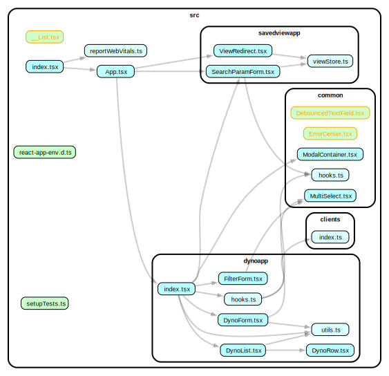

# Deps graph

App.tsx:
- ConfigForm
- DynoPage:
  - EditModal
    - SchemaForm
      - ListField
  - DynoTable
    - DynoList or Table
      - <Row>
        - formatField()
        - onSelect -> modal

